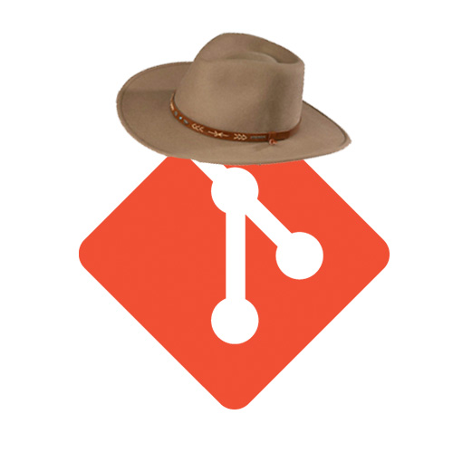

# Git Over Here


A homework helper for GA IAs. Inspired by simon-script.

## How to Use!

If this is your first time using _Git Over Here_, [make a personal access token](https://help.github.com/en/articles/creating-a-personal-access-token-for-the-command-line#creating-a-token) with __repo__ permissions, then run ```npm run setup``` to get started.

Follow the instructions and enter your organization's GitHub org (e.g. ```sei-nyc-jeopardy```), what you would like to be called (e.g. ```Homework Lord```), and your personal access token (e.g. `91v0b278wqjceh9qjrx8qw8e129bf8afasdf`).

Git Over Here will only ask for a token if you have not provided one. After you've set it up the first time, you should not need to provide a new one.

### Without -g

Run ```npm start``` to run the program.

Ask your students to post their full name as the title of the pull request. The first name will be split off and used as the name of their directory. (e.g. Alex Trebek).

### With -g

Do two or more of your students have the same name? Are your students just not adhering to pull request naming policy? You can run `npm start-g` to add their GitHub username to the end of the directory. So if someone starts their pull request name with "Sean" and has a GitHub Enterprise username of "blueseanie", the directory cloned down would be called `Sean-blueseanie`.

### After Setup

Then enter the repo you'd like to pull from (e.g. ```js-data-types-homework```).

> _Git Over Here_ will automatically clone the branch that students have submitted for their pull requests.

Once the repository has been found, answer whether or not the project has dependencies to install with npm and/or bundler (e.g. ```no```).

Pulling from the same repository twice will replace the old copy with the new open pulls.

## Upcoming Features:

- Finding Current Homeworks
